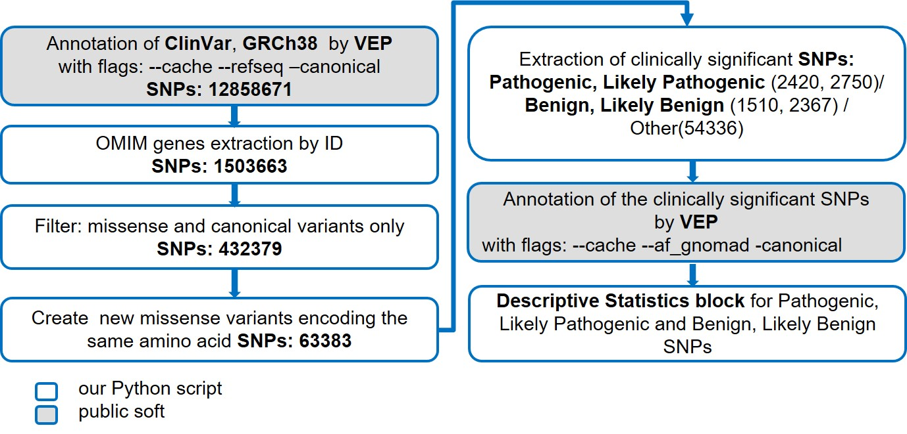
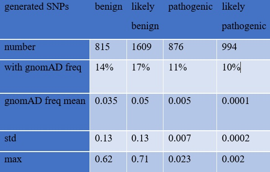

# Generation of possible single-nucleotide variants with a given effect on protein-coding sequence

BI 2022 Spring Student Project

**Author: <br>**
Oxana Kolpakova <br>
**Supervisors: <br>**
Yuri Barbitov (Bioinformatics institute) <br>
Mikhail Skoblov (Research Centre for Medical Genetics)<br>

## Motivation

* Public databases such as ClinVar and OMIM collect data on clinically relevant SNPs that show associations between genome and phenotype changes. 

* SNPs in the coding regions of the human genome, especially missense substitutions, are the most common cause of genetic pathology.

* However, not all significant SNPs have been identified and described. This complicates the identification of the molecular cause of a genetic disorder in people with a suspected hereditary disease.


## Aim


* Generate a tool to create pathogenic and benign SNPs for OMIM genes by substitution  1 nucleotide codon resulting in the same amino acid substitution. 

* Our tool expands the list of SNPs for OMIM genes and can be used to improve the molecular genetic diagnosis of hereditary diseases.

## Workflow:




## Requirements

This project has been tasted using the following software:
* Ubuntu 20.04
* Python 3.9
* Vep release 106

You can install the versions of the python libraries using the requirments.txt

```bash
pip install -r requirments.txt
```

The clinvar.vcf file is required to run the program. You can download it with the command:


```bash
wget https://ftp.ncbi.nlm.nih.gov/pub/clinvar/vcf_GRCh38/clinvar.vcf.gz
```

The ClinVar annotation requires Vep to be installed. https://www.ensembl.org/info/docs/tools/vep/script/vep_download.html

A cache is required to run VEP. It can be downloaded when installing VEP. If there are problems with the cache, you can download it manually. https://www.ensembl.org/info/docs/tools/vep/script/vep_cache.html#cache

## Installation

Clon this repository:

```bash
git clone https://github.com/OxanaKolpakova/new_SNP
```

## Usage

You can add the path to Vep to the path variable in the .bashrc file to run Vep from any directory
https://linuxhint.com/export-a-path-in-bashrc/

Or run the script from the Vep directory:

```bash
./vep --cache --refseq --af_gnomad -canonical -i path_to_clinvar.vcf -o path_to_out_directory/clinvar_vep_ref.vep
```

To create new missense variants encoding the same amino acid run the script:

```bash
python3 new_SNP.py -a clinvar_vep_ref.vep -b clinvar.vcf 
```

Vep variants annotation of benign.vcf, likely_benign.vcf, pathogenic.vcf, likely_pathogenic.vcf

```bash
./vep --cache --af_gnomad -canonical -i .benign.vcf -o ./OMIM_vep_gnomad/benign_vep.vcf 
./vep --cache --af_gnomad -canonical -i .likely_benign.vcf -o ./OMIM_vep_gnomad/likely_benign_vep.vcf
./vep --cache --af_gnomad -canonical -i .pathogenic.vcf -o ./OMIM_vep_gnomad/pathogenic_vep.vcf
./vep --cache --af_gnomad -canonical -i .likely_pathogenic.vcf -o ./OMIM_vep_gnomad/likely_pathogenic_vep.vcf
```

You can run new_SNP.ipynb to get statistics. Statistics are in section 6. Descriptive statistics of the results obtained

## Results 

The work results are presented in ./Results/new_SNP.ipynb

*	The script work accuracy was validated on coordinates of reference SNPs by Integrative Genomics Viewer, IGV; the script works correctly.
*	Generated pathogenic and benign SNPs were not previously described in OMIM and ClinVar DBs (Tab.1)




## Conclusions

*	We created a tool to generate pathogenic and benign SNPs for OMIM genes by substitution of 1 nucleotide codon resulting in the same amino acid substitution.
*	Generated pathogenic and benign SNPs were not previously described in OMIM and ClinVar DBs
*	Generated pathogenic and benign SNPs could increase the accuracy of molecular genetic diagnosis of diseases associated with OMIM genes
*	This tool can be used to create missense SNPs for other gene lists, not just OMIM.


In the future, we plan to
*	Expand the capabilities of the tool:<br> 
    * add status gnomAD >0.05<br>
    * consider exon/intron boundaries, - DNA strand<br>
    * evaluate the effects of SNPs at splicing boundaries<br>
*	Apply the script to real medical data to identify new pathogenic SNPs.<br>

